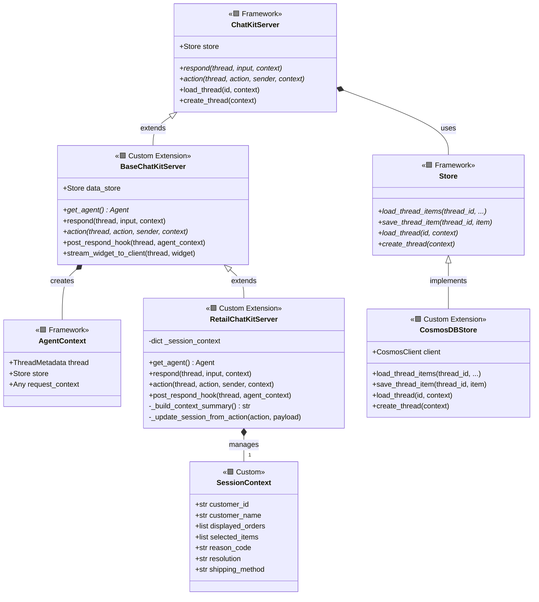
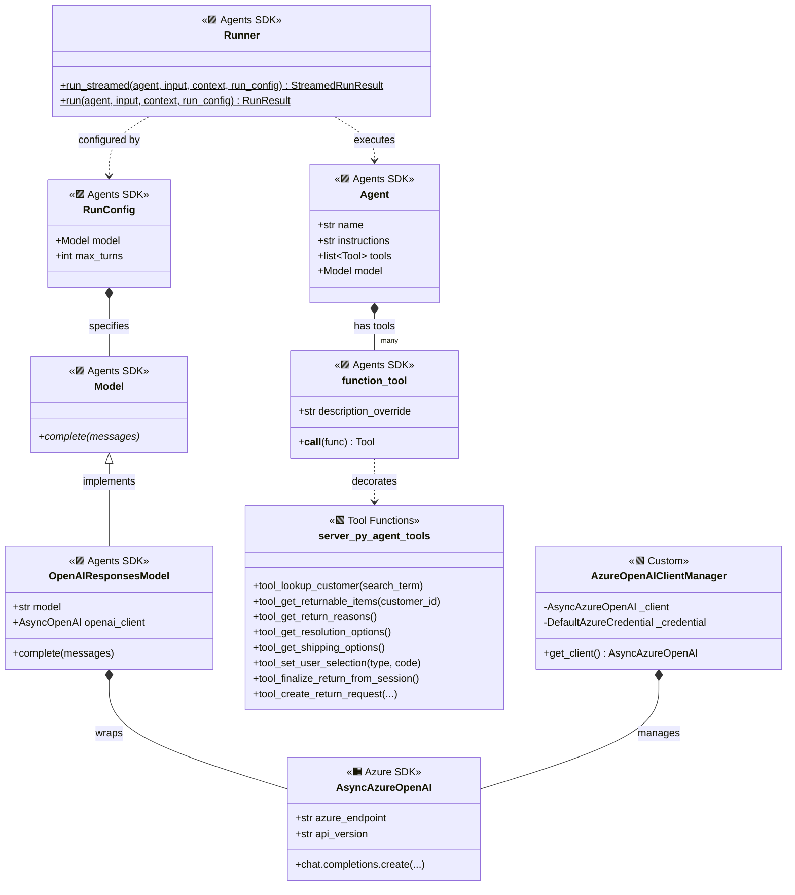
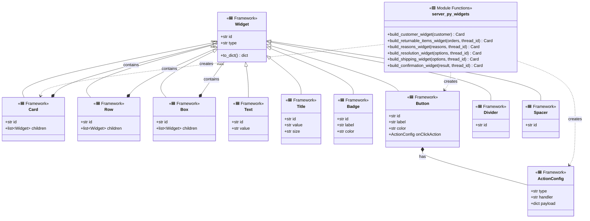
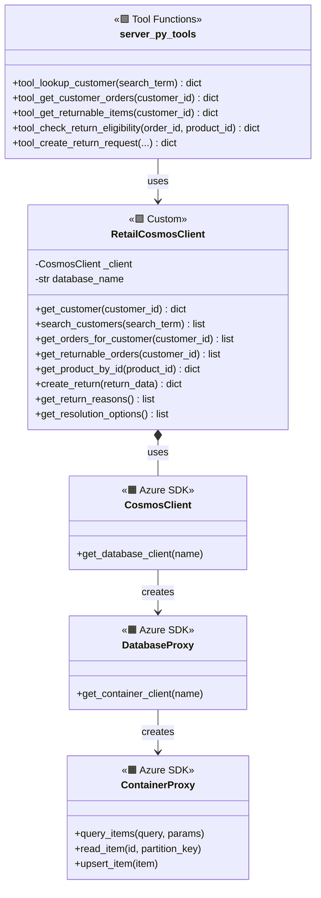
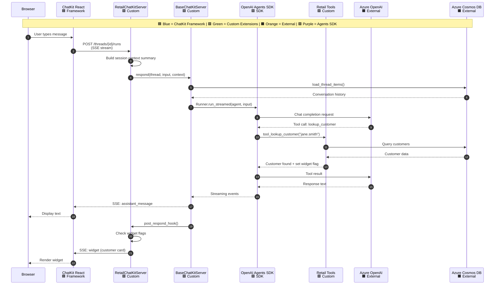
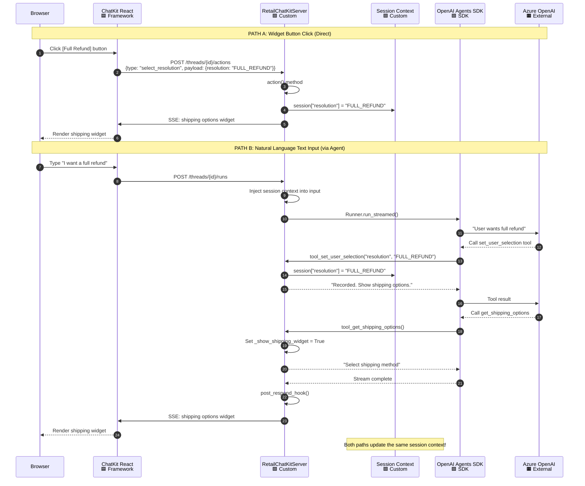
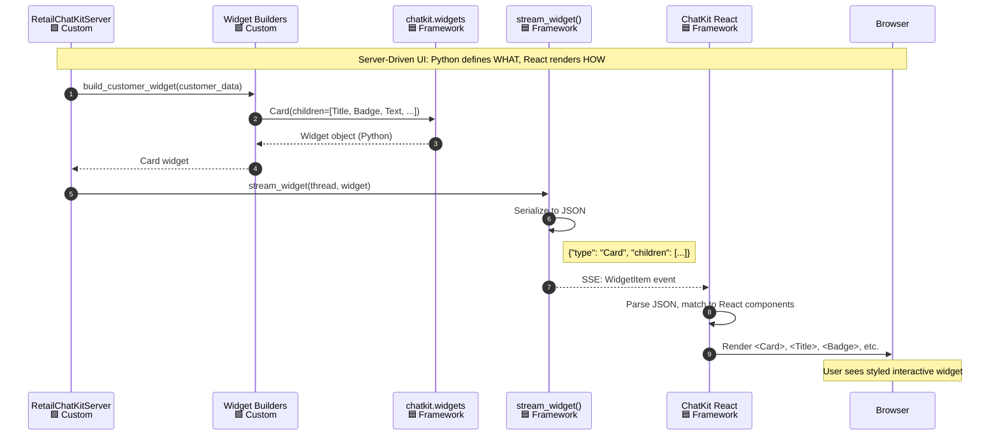
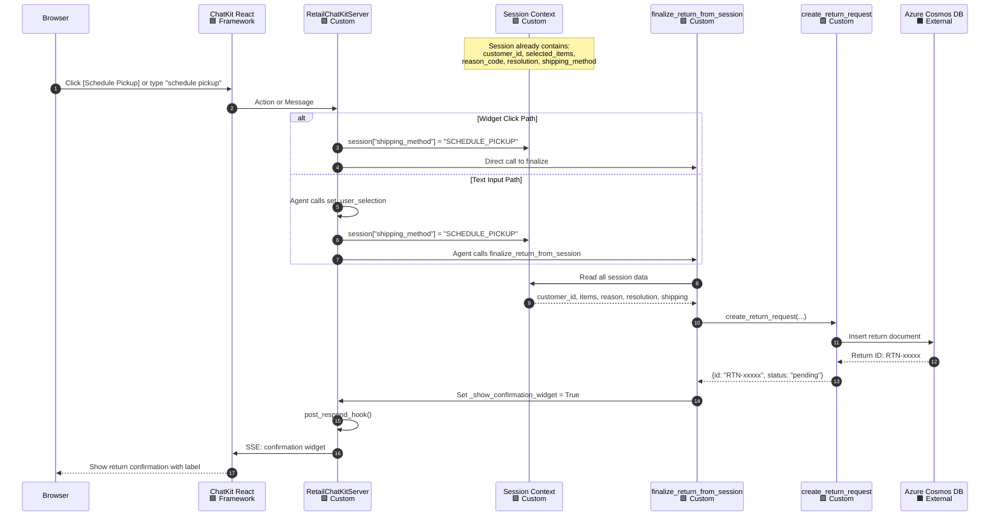
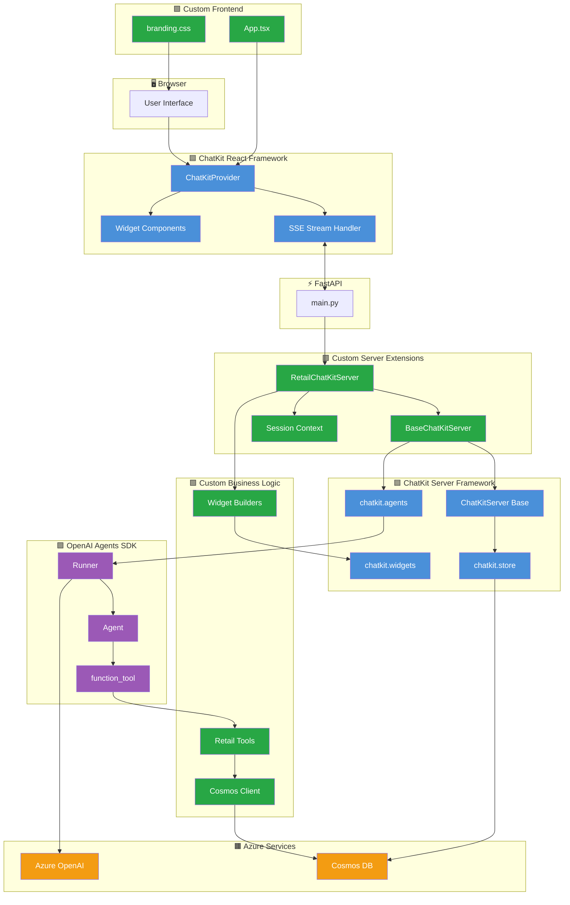

# ChatKit Order Returns - Architecture Diagrams

This document contains Mermaid diagrams showing the class hierarchy, component relationships, and end-to-end flow of the application.

## Color Legend

| Color | Component Type | Examples |
|-------|---------------|----------|
| 🟦 **Blue** | ChatKit Framework | `ChatKitServer`, `Store`, `chatkit.widgets`, `@openai/chatkit-react` |
| 🟩 **Green** | Custom Extensions | `RetailChatKitServer`, `BaseChatKitServer`, retail tools & widgets |
| 🟧 **Orange** | External Services | Azure OpenAI, Azure Cosmos DB |
| 🟪 **Purple** | OpenAI Agents SDK | `Agent`, `Runner`, `function_tool` |

---

## Class Diagrams

### 1. Server Class Hierarchy

This diagram shows the inheritance and composition relationships between server classes.



### 2. OpenAI Agents SDK Classes

This diagram shows the Agent SDK components and how we extend them.



### 3. Widget Classes

This diagram shows the widget hierarchy used for building UI components.



### 4. Data Layer Classes



---

## Sequence Diagrams

### 5. Complete Flow: User Message to Response

This diagram shows the full flow when a user sends a message (e.g., "I'm jane.smith@email.com, help me with returns").



---

### 6. Dual-Input Flow: Widget Click vs Text Input

This diagram shows how both widget button clicks and typed text converge into the same session context.



---

### 7. Widget Rendering Flow

This diagram shows how widgets are defined in Python and rendered in React.



---

### 8. Return Creation Flow (Finalize from Session)

This diagram shows the complete return creation using session data.



---

### 9. Component Architecture Overview (Flowchart)



---

## Embedding in Documentation

To embed these diagrams in your documentation:

### In GitHub README/Markdown
GitHub natively renders Mermaid diagrams. Just include the code block:

~~~markdown
```mermaid
sequenceDiagram
    ...
```
~~~

### In VS Code
Install the "Markdown Preview Mermaid Support" extension to preview locally.

### As Images
Use [mermaid.live](https://mermaid.live) to export diagrams as PNG/SVG.

---

*Document created: January 22, 2026*
