# ChatKit Order Returns - Architecture Diagrams

This document contains Mermaid diagrams showing the class hierarchy, component relationships, and end-to-end flow of the application.

## Table of Contents

### Class Diagrams
1. [Server Class Hierarchy](#1-server-class-hierarchy)
2. [OpenAI Agents SDK Classes](#2-openai-agents-sdk-classes)
3. [Widget Classes](#3-widget-classes)
4. [Data Layer Classes](#4-data-layer-classes)

### Sequence Diagrams
5. [Complete Flow: User Message to Response](#5-complete-flow-user-message-to-response)
6. [Dual-Input Flow: Widget Click vs Text Input](#6-dual-input-flow-widget-click-vs-text-input)
7. [Widget Rendering Flow](#7-widget-rendering-flow)
8. [Return Creation Flow](#8-return-creation-flow-finalize-from-session)
9. [Component Architecture Overview](#9-component-architecture-overview-flowchart)

### Layered Architecture (Core Framework)
10. [Layered Architecture Class Diagram](#10-layered-architecture-core-framework)
11. [Use Case Extension Pattern](#11-use-case-extension-pattern)
12. [Layered Data Flow](#12-layered-data-flow)

---

## Color Legend

| Color | Component Type | Examples |
|-------|---------------|----------|
| 🟦 **Blue** | ChatKit Framework | `ChatKitServer`, `Store`, `chatkit.widgets`, `@openai/chatkit-react` |
| 🟩 **Green** | Custom Extensions | `RetailChatKitServer`, `BaseChatKitServer`, retail tools & widgets |
| 🟧 **Orange** | External Services | Azure OpenAI, Azure Cosmos DB |
| 🟪 **Purple** | OpenAI Agents SDK | `Agent`, `Runner`, `function_tool` |

---

## Class Diagrams

### 1. Server Class Hierarchy

This diagram shows the inheritance and composition relationships between server classes, including the new core framework.

```mermaid
classDiagram
    direction TB
    
    %% ChatKit Framework Classes (Blue)
    class ChatKitServer {
        <<🟦 Framework>>
        +Store store
        +respond(thread, input, context)*
        +action(thread, action, sender, context)*
        +load_thread(id, context)
        +create_thread(context)
    }
    
    class Store {
        <<🟦 Framework>>
        +load_thread_items(thread_id, ...)*
        +save_thread_item(thread_id, item)*
        +load_thread(id, context)*
        +create_thread(context)*
    }
    
    class AgentContext {
        <<🟦 Framework>>
        +ThreadMetadata thread
        +Store store
        +Any request_context
    }
    
    %% Core Framework Base Classes (Blue - core/)
    class UseCaseServer {
        <<🟦 Core Framework>>
        +Store data_store
        +SessionManager session_manager
        +ToolRegistry tool_registry
        +WidgetComposer widget_composer
        +get_agent()* Agent
        +get_system_prompt()* str
        +create_widget_composer()* WidgetComposer
        +handle_action()* AsyncIterator
        +build_context_summary(session) str
    }
    
    class SessionContext {
        <<🟦 Core Framework>>
        +str thread_id
        +str customer_id
        +Dict selections
        +List queued_widgets
        +to_context_string() str
        +queue_widget(type, data)
    }
    
    class WidgetComposer {
        <<🟦 Core Framework>>
        +WidgetTheme theme
        +compose(widget_type, data, thread_id) Widget
        +get_widget_builders()* Dict
    }
    
    %% Custom Base Server (Green)
    class BaseChatKitServer {
        <<🟩 Custom Extension>>
        +Store data_store
        +get_agent()* Agent
        +respond(thread, input, context)
        +action(thread, action, sender, context)*
        +post_respond_hook(thread, agent_context)
        +stream_widget_to_client(thread, widget)
    }
    
    %% Custom Retail Server (Green)
    class RetailChatKitServer {
        <<🟩 Retail Use Case>>
        -dict _session_context
        +get_agent() Agent
        +respond(thread, input, context)
        +action(thread, action, sender, context)
        +post_respond_hook(thread, agent_context)
        -_build_context_summary() str
    }
    
    %% Retail Session Context (Green)
    class ReturnSessionContext {
        <<🟩 Retail Use Case>>
        +ReturnFlowStep flow_step
        +List displayed_orders
        +List selected_items
        +str reason_code
        +str resolution
        +is_ready_to_create_return() bool
    }
    
    %% Custom Store Implementation (Green)
    class CosmosDBStore {
        <<🟩 Custom Extension>>
        +CosmosClient client
        +load_thread_items(thread_id, ...)
        +save_thread_item(thread_id, item)
        +load_thread(id, context)
        +create_thread(context)
    }
    
    %% Inheritance - Core Framework
    ChatKitServer <|-- UseCaseServer : extends
    ChatKitServer <|-- BaseChatKitServer : extends
    SessionContext <|-- ReturnSessionContext : extends
    
    %% Inheritance - Retail
    BaseChatKitServer <|-- RetailChatKitServer : extends
    Store <|-- CosmosDBStore : implements
    
    %% Composition
    ChatKitServer *-- Store : uses
    UseCaseServer *-- SessionContext : manages
    UseCaseServer *-- WidgetComposer : uses
    BaseChatKitServer *-- AgentContext : creates
    RetailChatKitServer *-- ReturnSessionContext : manages
        +list selected_items
        +str reason_code
        +str resolution
        +str shipping_method
    }
```

### 2. OpenAI Agents SDK Classes

This diagram shows the Agent SDK components and how we extend them.

```mermaid
classDiagram
    direction TB
    
    %% Agents SDK Classes (Purple)
    class Agent {
        <<🟪 Agents SDK>>
        +str name
        +str instructions
        +list~Tool~ tools
        +Model model
    }
    
    class Runner {
        <<🟪 Agents SDK>>
        +run_streamed(agent, input, context, run_config)$ StreamedRunResult
        +run(agent, input, context, run_config)$ RunResult
    }
    
    class RunConfig {
        <<🟪 Agents SDK>>
        +Model model
        +int max_turns
    }
    
    class Model {
        <<🟪 Agents SDK>>
        +complete(messages)*
    }
    
    class OpenAIResponsesModel {
        <<🟪 Agents SDK>>
        +str model
        +AsyncOpenAI openai_client
        +complete(messages)
    }
    
    class function_tool {
        <<🟪 Agents SDK>>
        +str description_override
        +__call__(func) Tool
    }
    
    %% Tool Functions (Green) - @function_tool decorated in server.py
    class server_py_agent_tools {
        <<🟩 Tool Functions>>
        +tool_lookup_customer(search_term)
        +tool_get_returnable_items(customer_id)
        +tool_get_return_reasons()
        +tool_get_resolution_options()
        +tool_get_shipping_options()
        +tool_set_user_selection(type, code)
        +tool_finalize_return_from_session()
        +tool_create_return_request(...)
    }
    
    %% Azure Client (Green/Orange)
    class AzureOpenAIClientManager {
        <<🟩 Custom>>
        -AsyncAzureOpenAI _client
        -DefaultAzureCredential _credential
        +get_client() AsyncAzureOpenAI
    }
    
    class AsyncAzureOpenAI {
        <<🟧 Azure SDK>>
        +str azure_endpoint
        +str api_version
        +chat.completions.create(...)
    }
    
    %% Relationships
    Model <|-- OpenAIResponsesModel : implements
    Agent *-- "many" function_tool : has tools
    Runner ..> Agent : executes
    Runner ..> RunConfig : configured by
    RunConfig *-- Model : specifies
    OpenAIResponsesModel *-- AsyncAzureOpenAI : wraps
    AzureOpenAIClientManager *-- AsyncAzureOpenAI : manages
    
    function_tool ..> server_py_agent_tools : decorates
```

### 3. Widget Classes

This diagram shows the widget hierarchy and the new WidgetComposer pattern for building UI components.

```mermaid
classDiagram
    direction TB
    
    %% ChatKit Widget Base (Blue)
    class Widget {
        <<🟦 Framework>>
        +str id
        +str type
        +to_dict() dict
    }
    
    %% Container Widgets (Blue)
    class Card {
        <<🟦 Framework>>
        +str id
        +list~Widget~ children
    }
    
    class Row {
        <<🟦 Framework>>
        +str id
        +list~Widget~ children
    }
    
    class Box {
        <<🟦 Framework>>
        +str id
        +list~Widget~ children
    }
    
    %% Content Widgets (Blue)
    class Text {
        <<🟦 Framework>>
        +str id
        +str value
    }
    
    class Title {
        <<🟦 Framework>>
        +str id
        +str value
        +str size
    }
    
    class Badge {
        <<🟦 Framework>>
        +str id
        +str label
        +str color
    }
    
    class Button {
        <<🟦 Framework>>
        +str id
        +str label
        +str color
        +ActionConfig onClickAction
    }
    
    class Divider {
        <<🟦 Framework>>
        +str id
    }
    
    class Spacer {
        <<🟦 Framework>>
        +str id
    }
    
    %% Action Config (Blue)
    class ActionConfig {
        <<🟦 Framework>>
        +str type
        +str handler
        +dict payload
    }
    
    %% Core WidgetComposer (Blue - core/)
    class WidgetComposer {
        <<🟦 Core Framework>>
        +WidgetTheme theme
        +compose(widget_type, data, thread_id) Widget
        +get_widget_builders()* Dict
        +create_action_button(label, handler, payload) Button
    }
    
    class WidgetTheme {
        <<🟦 Core Framework>>
        +str primary_color
        +str success_color
        +str warning_color
        +str text_color
    }
    
    %% Retail WidgetComposer (Green)
    class ReturnWidgetComposer {
        <<🟩 Retail Use Case>>
        +WidgetTheme theme
        +get_widget_builders() Dict
        +build_customer_widget(customer) Card
        +build_returnable_items_widget(orders, thread_id) Card
        +build_reasons_widget(reasons, thread_id) Card
        +build_resolution_widget(options, thread_id) Card
        +build_shipping_widget(options, thread_id) Card
        +build_confirmation_widget(result, thread_id) Card
    }
    
    %% Inheritance
    Widget <|-- Card
    Widget <|-- Row
    Widget <|-- Box
    Widget <|-- Text
    Widget <|-- Title
    Widget <|-- Badge
    Widget <|-- Button
    Widget <|-- Divider
    Widget <|-- Spacer
    
    WidgetComposer <|-- ReturnWidgetComposer : extends
    WidgetComposer *-- WidgetTheme : uses
    
    %% Composition
    Card *-- "many" Widget : contains
    Row *-- "many" Widget : contains
    Box *-- "many" Widget : contains
    Button *-- ActionConfig : has
    
    ReturnWidgetComposer ..> Card : creates
    ReturnWidgetComposer ..> Button : creates
    ReturnWidgetComposer ..> ActionConfig : creates
```

### 4. Data Layer Classes

This diagram shows the data layer with the core Repository pattern and retail implementation.

```mermaid
classDiagram
    direction TB
    
    %% Core Framework Base Classes (Blue - core/)
    class Repository {
        <<🟦 Core Framework>>
        +get_by_id(id, partition_key)* Any
        +query(query, params)* List
        +upsert(entity)* Any
        +delete(id, partition_key)* bool
    }
    
    class QueryOptions {
        <<🟦 Core Framework>>
        +int page_size
        +str continuation_token
        +str order_by
    }
    
    %% Retail Cosmos DB Client (Green)
    class RetailCosmosClient {
        <<🟩 Retail Use Case>>
        -CosmosClient _client
        -str database_name
        +get_customer(customer_id) dict
        +search_customers(search_term) list
        +get_orders_for_customer(customer_id) list
        +get_returnable_orders(customer_id) list
        +get_product_by_id(product_id) dict
        +create_return(return_data) dict
        +get_return_reasons() list
        +get_resolution_options() list
    }
    
    %% Azure Cosmos SDK (Orange)
    class CosmosClient {
        <<🟧 Azure SDK>>
        +get_database_client(name)
    }
    
    class DatabaseProxy {
        <<🟧 Azure SDK>>
        +get_container_client(name)
    }
    
    class ContainerProxy {
        <<🟧 Azure SDK>>
        +query_items(query, params)
        +read_item(id, partition_key)
        +upsert_item(item)
    }
    
    %% Agent Tool Functions (Green) - @function_tool decorated
    class RetailTools {
        <<🟩 Tool Functions>>
        +tool_lookup_customer(search_term) dict
        +tool_get_customer_orders(customer_id) dict
        +tool_get_returnable_items(customer_id) dict
        +tool_check_return_eligibility(order_id, product_id) dict
        +tool_create_return_request(...) dict
    }
    
    %% Relationships
    Repository <|-- RetailCosmosClient : implements
    RetailCosmosClient *-- CosmosClient : uses
    CosmosClient --> DatabaseProxy : creates
    DatabaseProxy --> ContainerProxy : creates
    RetailTools --> RetailCosmosClient : uses
```

---

## Sequence Diagrams

### 5. Complete Flow: User Message to Response

This diagram shows the full flow when a user sends a message (e.g., "I'm jane.smith@email.com, help me with returns"), using the layered architecture.

```mermaid
sequenceDiagram
    autonumber
    
    %% Participants with colors indicated by notes
    participant Browser
    participant ChatKitReact as ChatKit React<br/>🟦 Framework
    participant RetailServer as RetailChatKitServer<br/>🟩 Retail Use Case
    participant SessionCtx as ReturnSessionContext<br/>🟩 Retail Use Case
    participant BaseServer as BaseChatKitServer<br/>🟩 Custom Base
    participant AgentSDK as OpenAI Agents SDK<br/>🟪 SDK
    participant RetailTools as Retail Tools<br/>🟩 Retail Use Case
    participant WidgetComposer as ReturnWidgetComposer<br/>🟩 Retail Use Case
    participant AzureOpenAI as Azure OpenAI<br/>🟧 External
    participant CosmosDB as Azure Cosmos DB<br/>🟧 External

    Note over Browser,CosmosDB: 🟦 Blue = ChatKit Framework | 🟩 Green = Custom Extensions | 🟧 Orange = External | 🟪 Purple = Agents SDK

    %% User sends message
    Browser->>ChatKitReact: User types message
    ChatKitReact->>RetailServer: POST /threads/{id}/runs<br/>(SSE stream)
    
    %% Server processing with session context
    RetailServer->>SessionCtx: get/create session
    SessionCtx-->>RetailServer: ReturnSessionContext
    RetailServer->>RetailServer: Build context summary from session
    RetailServer->>BaseServer: respond(thread, input, context)
    
    %% History loading
    BaseServer->>CosmosDB: load_thread_items()
    CosmosDB-->>BaseServer: Conversation history
    
    %% Agent execution
    BaseServer->>AgentSDK: Runner.run_streamed(agent, input)
    AgentSDK->>AzureOpenAI: Chat completion request
    AzureOpenAI-->>AgentSDK: Tool call: lookup_customer
    
    %% Tool execution
    AgentSDK->>RetailTools: tool_lookup_customer("jane.smith")
    RetailTools->>CosmosDB: Query customers
    CosmosDB-->>RetailTools: Customer data
    RetailTools->>SessionCtx: Queue customer widget
    RetailTools-->>AgentSDK: Customer found
    
    %% Continue agent
    AgentSDK->>AzureOpenAI: Tool result
    AzureOpenAI-->>AgentSDK: Response text
    
    %% Stream response
    AgentSDK-->>BaseServer: Streaming events
    BaseServer-->>ChatKitReact: SSE: assistant_message
    ChatKitReact-->>Browser: Display text
    
    %% Post-respond hook for widgets - use WidgetComposer
    BaseServer->>RetailServer: post_respond_hook()
    RetailServer->>SessionCtx: Get queued widgets
    SessionCtx-->>RetailServer: [customer_widget]
    RetailServer->>WidgetComposer: build_customer_widget(data)
    WidgetComposer-->>RetailServer: Card widget
    RetailServer->>ChatKitReact: SSE: widget (customer card)
    ChatKitReact-->>Browser: Render widget
```

---

### 6. Dual-Input Flow: Widget Click vs Text Input

This diagram shows how both widget button clicks and typed text converge into the same session context.

```mermaid
sequenceDiagram
    autonumber
    
    participant Browser
    participant ChatKitReact as ChatKit React<br/>🟦 Framework
    participant RetailServer as RetailChatKitServer<br/>🟩 Retail Use Case
    participant SessionCtx as ReturnSessionContext<br/>🟩 Retail Use Case
    participant WidgetComposer as ReturnWidgetComposer<br/>🟩 Retail Use Case
    participant AgentSDK as OpenAI Agents SDK<br/>🟪 SDK
    participant AzureOpenAI as Azure OpenAI<br/>🟧 External

    Note over Browser,AzureOpenAI: PATH A: Widget Button Click (Direct)

    Browser->>ChatKitReact: Click [Full Refund] button
    ChatKitReact->>RetailServer: POST /threads/{id}/actions<br/>{type: "select_resolution", payload: {resolution: "FULL_REFUND"}}
    RetailServer->>RetailServer: action() method
    RetailServer->>SessionCtx: resolution = FULL_REFUND
    RetailServer->>WidgetComposer: build_shipping_widget()
    WidgetComposer-->>RetailServer: Shipping widget
    RetailServer->>ChatKitReact: SSE: shipping options widget
    ChatKitReact-->>Browser: Render shipping widget

    Note over Browser,AzureOpenAI: PATH B: Natural Language Text Input (via Agent)

    Browser->>ChatKitReact: Type "I want a full refund"
    ChatKitReact->>RetailServer: POST /threads/{id}/runs
    RetailServer->>RetailServer: Inject session context into input
    RetailServer->>AgentSDK: Runner.run_streamed()
    AgentSDK->>AzureOpenAI: "User wants full refund"
    AzureOpenAI-->>AgentSDK: Call set_user_selection tool
    AgentSDK->>RetailServer: tool_set_user_selection("resolution", "FULL_REFUND")
    RetailServer->>SessionCtx: resolution = FULL_REFUND
    RetailServer-->>AgentSDK: "Recorded. Show shipping options."
    AgentSDK->>AzureOpenAI: Tool result
    AzureOpenAI-->>AgentSDK: Call get_shipping_options
    AgentSDK->>RetailServer: tool_get_shipping_options()
    RetailServer->>SessionCtx: Queue shipping widget
    RetailServer-->>AgentSDK: "Select shipping method"
    AgentSDK-->>RetailServer: Stream complete
    RetailServer->>RetailServer: post_respond_hook()
    RetailServer->>SessionCtx: Get queued widgets
    RetailServer->>WidgetComposer: build_shipping_widget()
    RetailServer->>ChatKitReact: SSE: shipping options widget
    ChatKitReact-->>Browser: Render shipping widget

    Note over SessionCtx: Both paths update the same ReturnSessionContext!
```

---

### 7. Widget Rendering Flow

This diagram shows how widgets are defined using the WidgetComposer pattern and rendered in React.

```mermaid
sequenceDiagram
    autonumber
    
    participant RetailServer as RetailChatKitServer<br/>🟩 Retail Use Case
    participant WidgetComposer as ReturnWidgetComposer<br/>🟩 Retail Use Case
    participant ChatKitWidgets as chatkit.widgets<br/>🟦 Framework
    participant StreamWidget as stream_widget()<br/>🟦 Framework
    participant ChatKitReact as ChatKit React<br/>🟦 Framework
    participant Browser

    Note over RetailServer,Browser: Server-Driven UI: Python defines WHAT, React renders HOW

    RetailServer->>WidgetComposer: compose("customer", customer_data)
    WidgetComposer->>WidgetComposer: get_widget_builders()["customer"]
    WidgetComposer->>ChatKitWidgets: Card(children=[Title, Badge, Text, ...])
    ChatKitWidgets-->>WidgetComposer: Widget object (Python)
    WidgetComposer-->>RetailServer: Card widget
    
    RetailServer->>StreamWidget: stream_widget(thread, widget)
    StreamWidget->>StreamWidget: Serialize to JSON
    Note right of StreamWidget: {"type": "Card", "children": [...]}
    StreamWidget-->>ChatKitReact: SSE: WidgetItem event
    
    ChatKitReact->>ChatKitReact: Parse JSON, match to React components
    ChatKitReact->>Browser: Render <Card>, <Title>, <Badge>, etc.
    
    Note over Browser: User sees styled interactive widget
```

---

### 8. Return Creation Flow (Finalize from Session)

This diagram shows the complete return creation using session data with the layered architecture.

```mermaid
sequenceDiagram
    autonumber
    
    participant Browser
    participant ChatKitReact as ChatKit React<br/>🟦 Framework
    participant RetailServer as RetailChatKitServer<br/>🟩 Retail Use Case
    participant SessionCtx as ReturnSessionContext<br/>🟩 Retail Use Case
    participant WidgetComposer as ReturnWidgetComposer<br/>🟩 Retail Use Case
    participant FinalizeTools as finalize_return_from_session<br/>🟩 Retail Use Case
    participant RetailTools as create_return_request<br/>🟩 Retail Use Case
    participant CosmosDB as Azure Cosmos DB<br/>🟧 External

    Note over SessionCtx: ReturnSessionContext already contains:<br/>customer_id, selected_items,<br/>reason_code, resolution, shipping_method

    Browser->>ChatKitReact: Click [Schedule Pickup] or type "schedule pickup"
    ChatKitReact->>RetailServer: Action or Message
    
    alt Widget Click Path
        RetailServer->>SessionCtx: shipping_method = SCHEDULE_PICKUP
        RetailServer->>FinalizeTools: Direct call to finalize
    else Text Input Path
        RetailServer->>RetailServer: Agent calls set_user_selection
        RetailServer->>SessionCtx: session["shipping_method"] = "SCHEDULE_PICKUP"
        RetailServer->>FinalizeTools: Agent calls finalize_return_from_session
    end
    
    FinalizeTools->>SessionCtx: Read all session data
    SessionCtx-->>FinalizeTools: customer_id, items, reason, resolution, shipping
    
    FinalizeTools->>RetailTools: create_return_request(...)
    RetailTools->>CosmosDB: Insert return document
    CosmosDB-->>RetailTools: Return ID: RTN-xxxxx
    RetailTools-->>FinalizeTools: {id: "RTN-xxxxx", status: "pending"}
    
    FinalizeTools->>SessionCtx: Queue confirmation widget
    RetailServer->>RetailServer: post_respond_hook()
    RetailServer->>SessionCtx: Get queued widgets
    RetailServer->>WidgetComposer: build_confirmation_widget(result)
    RetailServer->>ChatKitReact: SSE: confirmation widget
    ChatKitReact-->>Browser: Show return confirmation with label
```

---

### 9. Component Architecture Overview (Flowchart)

```mermaid
flowchart TB
    subgraph Browser["🖥️ Browser"]
        UI[User Interface]
    end
    
    subgraph ChatKitReact["🟦 ChatKit React Framework"]
        CKProvider[ChatKitProvider]
        CKComponents[Widget Components]
        CKStreaming[SSE Stream Handler]
    end
    
    subgraph CustomFrontend["🟩 Custom Frontend"]
        AppTsx[App.tsx]
        Branding[branding.css]
    end
    
    subgraph FastAPI["⚡ FastAPI"]
        MainPy[main.py]
    end
    
    subgraph ChatKitServer["🟦 ChatKit Server Framework"]
        CKServer[ChatKitServer Base]
        CKAgents[chatkit.agents]
        CKWidgets[chatkit.widgets]
        CKStore[chatkit.store]
    end
    
    subgraph CoreFramework["🟦 Core Framework (core/)"]
        SessionContext[SessionContext]
        WidgetComposer[WidgetComposer]
        Repository[Repository]
        PolicyEngine[PolicyEngine]
    end
    
    subgraph CustomServer["🟩 Custom Server Extensions"]
        BaseServer[BaseChatKitServer]
        RetailServer[RetailChatKitServer]
    end
    
    subgraph RetailDomain["🟩 Retail Use Case"]
        ReturnSessionCtx[ReturnSessionContext]
        ReturnWidgetComposer[ReturnWidgetComposer]
        RetailTools[Retail Tools]
        RetailPolicies[Return Policies]
        CosmosClient[Cosmos Client]
    end
    
    subgraph AgentsSDK["🟪 OpenAI Agents SDK"]
        Agent[Agent]
        Runner[Runner]
        FunctionTool[function_tool]
    end
    
    subgraph Azure["🟧 Azure Services"]
        AzureOpenAI[Azure OpenAI]
        CosmosDB[Cosmos DB]
    end
    
    UI --> CKProvider
    CKProvider --> CKComponents
    CKProvider --> CKStreaming
    AppTsx --> CKProvider
    Branding --> UI
    
    CKStreaming <--> MainPy
    MainPy --> RetailServer
    RetailServer --> BaseServer
    BaseServer --> CKServer
    
    %% Core Framework connections
    SessionContext --> ReturnSessionCtx
    WidgetComposer --> ReturnWidgetComposer
    Repository --> CosmosClient
    PolicyEngine --> RetailPolicies
    
    %% Retail Use Case connections
    RetailServer --> ReturnSessionCtx
    RetailServer --> ReturnWidgetComposer
    ReturnWidgetComposer --> CKWidgets
    
    BaseServer --> CKAgents
    CKAgents --> Runner
    Runner --> Agent
    Agent --> FunctionTool
    FunctionTool --> RetailTools
    
    RetailTools --> CosmosClient
    CosmosClient --> CosmosDB
    
    Runner --> AzureOpenAI
    
    CKServer --> CKStore
    CKStore --> CosmosDB

    style CKProvider fill:#4a90d9,color:#fff
    style CKComponents fill:#4a90d9,color:#fff
    style CKStreaming fill:#4a90d9,color:#fff
    style CKServer fill:#4a90d9,color:#fff
    style CKAgents fill:#4a90d9,color:#fff
    style CKWidgets fill:#4a90d9,color:#fff
    style CKStore fill:#4a90d9,color:#fff
    style SessionContext fill:#4a90d9,color:#fff
    style WidgetComposer fill:#4a90d9,color:#fff
    style Repository fill:#4a90d9,color:#fff
    style PolicyEngine fill:#4a90d9,color:#fff
    
    style BaseServer fill:#28a745,color:#fff
    style RetailServer fill:#28a745,color:#fff
    style ReturnSessionCtx fill:#28a745,color:#fff
    style ReturnWidgetComposer fill:#28a745,color:#fff
    style RetailTools fill:#28a745,color:#fff
    style RetailPolicies fill:#28a745,color:#fff
    style CosmosClient fill:#28a745,color:#fff
    style AppTsx fill:#28a745,color:#fff
    style Branding fill:#28a745,color:#fff
    
    style Agent fill:#9b59b6,color:#fff
    style Runner fill:#9b59b6,color:#fff
    style FunctionTool fill:#9b59b6,color:#fff
    
    style AzureOpenAI fill:#f39c12,color:#fff
    style CosmosDB fill:#f39c12,color:#fff
```

---

## Embedding in Documentation

To embed these diagrams in your documentation:

### In GitHub README/Markdown
GitHub natively renders Mermaid diagrams. Just include the code block:

~~~markdown
```mermaid
sequenceDiagram
    ...
```
~~~

### In VS Code
Install the "Markdown Preview Mermaid Support" extension to preview locally.

### As Images
Use [mermaid.live](https://mermaid.live) to export diagrams as PNG/SVG.

---

## 10. Layered Architecture (Core Framework)

This diagram shows the new extensible layered architecture in the `core/` module.

```mermaid
classDiagram
    direction TB
    
    %% Core Framework Base Classes (Blue)
    class PolicyEngine {
        <<🟦 Core Framework>>
        +evaluate(context)* PolicyDecision
        +get_policies()* List[str]
    }
    
    class DomainService {
        <<🟦 Core Framework>>
        +execute(data)* Any
    }
    
    class Validator {
        <<🟦 Core Framework>>
        +validate(data)* ValidationResult
    }
    
    class Repository~T~ {
        <<🟦 Core Framework>>
        +get(id)* T
        +list(options)* QueryResult
        +save(entity)* T
        +delete(id)* bool
    }
    
    class WidgetComposer {
        <<🟦 Core Framework>>
        +theme WidgetTheme
        +compose(widget_type, data, thread_id) Widget
        +get_widget_builders()* Dict
    }
    
    class SessionContext {
        <<🟦 Core Framework>>
        +thread_id str
        +customer_id str
        +selections Dict
        +queue_widget(type, data)
        +to_context_string() str
    }
    
    class UseCaseServer {
        <<🟦 Core Framework>>
        +data_store Store
        +session_manager SessionManager
        +tool_registry ToolRegistry
        +get_agent()* Agent
        +get_system_prompt()* str
        +create_widget_composer()* WidgetComposer
        +handle_action()* AsyncIterator
    }
    
    %% Retail Implementation (Green)
    class ReturnEligibilityPolicy {
        <<🟩 Retail Domain>>
        +evaluate(context) PolicyDecision
        +check_return_window(days) bool
        +check_category(category) bool
    }
    
    class RefundCalculator {
        <<🟩 Retail Domain>>
        +calculate(items, tier, reason) RefundResult
    }
    
    class RetailCosmosClient {
        <<🟩 Retail Data>>
        +get_customer(id) dict
        +get_orders(customer_id) list
        +create_return(data) dict
    }
    
    class ReturnWidgetComposer {
        <<🟩 Retail Presentation>>
        +compose_customer_card(customer) Card
        +compose_returnable_items(orders) Card
        +compose_reasons(reasons) Card
        +compose_confirmation(result) Card
    }
    
    class ReturnSessionContext {
        <<🟩 Retail Session>>
        +flow_step ReturnFlowStep
        +displayed_orders list
        +selected_items list
        +reason_code str
        +is_ready_to_create_return() bool
    }
    
    %% Inheritance
    PolicyEngine <|-- ReturnEligibilityPolicy : extends
    DomainService <|-- RefundCalculator : extends
    WidgetComposer <|-- ReturnWidgetComposer : extends
    SessionContext <|-- ReturnSessionContext : extends
    
    %% Composition in UseCaseServer
    UseCaseServer *-- SessionContext : manages
    UseCaseServer *-- WidgetComposer : uses
    UseCaseServer *-- "1" ToolRegistry : has
```

### 11. Use Case Extension Pattern

This diagram shows how to create a new use case by extending the core framework.

```mermaid
flowchart TB
    subgraph Core["🟦 Core Framework (core/)"]
        PolicyEngine[PolicyEngine]
        Repository[Repository]
        WidgetComposer[WidgetComposer]
        SessionContext[SessionContext]
        UseCaseServer[UseCaseServer]
    end
    
    subgraph Retail["🟩 Retail Use Case"]
        ReturnPolicy[ReturnEligibilityPolicy]
        RetailRepo[RetailCosmosClient]
        ReturnComposer[ReturnWidgetComposer]
        ReturnSession[ReturnSessionContext]
        RetailServer[RetailChatKitServer]
    end
    
    subgraph Healthcare["🟪 Healthcare Use Case (Example)"]
        ApptPolicy[AppointmentPolicy]
        HealthRepo[HealthcareCosmosClient]
        ApptComposer[AppointmentWidgetComposer]
        ApptSession[AppointmentSessionContext]
        HealthServer[HealthcareChatKitServer]
    end
    
    PolicyEngine --> ReturnPolicy
    PolicyEngine --> ApptPolicy
    Repository --> RetailRepo
    Repository --> HealthRepo
    WidgetComposer --> ReturnComposer
    WidgetComposer --> ApptComposer
    SessionContext --> ReturnSession
    SessionContext --> ApptSession
    UseCaseServer --> RetailServer
    UseCaseServer --> HealthServer
    
    style PolicyEngine fill:#4a90d9,color:#fff
    style Repository fill:#4a90d9,color:#fff
    style WidgetComposer fill:#4a90d9,color:#fff
    style SessionContext fill:#4a90d9,color:#fff
    style UseCaseServer fill:#4a90d9,color:#fff
    
    style ReturnPolicy fill:#28a745,color:#fff
    style RetailRepo fill:#28a745,color:#fff
    style ReturnComposer fill:#28a745,color:#fff
    style ReturnSession fill:#28a745,color:#fff
    style RetailServer fill:#28a745,color:#fff
    
    style ApptPolicy fill:#9b59b6,color:#fff
    style HealthRepo fill:#9b59b6,color:#fff
    style ApptComposer fill:#9b59b6,color:#fff
    style ApptSession fill:#9b59b6,color:#fff
    style HealthServer fill:#9b59b6,color:#fff
```

### 12. Layered Data Flow

```mermaid
sequenceDiagram
    autonumber
    
    participant Browser
    participant Server as UseCaseServer<br/>🟦 Orchestration
    participant Session as SessionContext<br/>🟦 Session
    participant Composer as WidgetComposer<br/>🟦 Presentation
    participant Policy as PolicyEngine<br/>🟦 Domain
    participant Repo as Repository<br/>🟦 Data
    participant CosmosDB as Cosmos DB<br/>🟧 External

    Note over Browser,CosmosDB: Layered Architecture: Each layer has a single responsibility

    Browser->>Server: User action (e.g., select item)
    
    Server->>Session: Get current session state
    Session-->>Server: SessionContext with selections
    
    Server->>Repo: Fetch data (orders, items)
    Repo->>CosmosDB: Query database
    CosmosDB-->>Repo: Raw data
    Repo-->>Server: Domain entities
    
    Server->>Policy: Check business rules
    Note right of Policy: Pure logic - no I/O!
    Policy-->>Server: PolicyDecision (approved/denied)
    
    Server->>Session: Update session state
    
    Server->>Composer: Build response widget
    Note right of Composer: Uses theme, builds ChatKit widgets
    Composer-->>Server: Card widget
    
    Server-->>Browser: Stream widget via SSE
```

---

*Document created: January 22, 2026*
