# ChatKit Order Returns - Sequence Diagrams

This document contains Mermaid sequence diagrams showing the end-to-end flow of the application.

## Color Legend

| Color | Component Type | Examples |
|-------|---------------|----------|
| 🟦 **Blue** | ChatKit Framework | `@openai/chatkit-react`, `ChatKitServer`, `stream_agent_response` |
| 🟩 **Green** | Custom Extensions | `RetailChatKitServer`, `BaseChatKitServer`, retail tools & widgets |
| 🟧 **Orange** | External Services | Azure OpenAI, Azure Cosmos DB |
| 🟪 **Purple** | OpenAI Agents SDK | `Agent`, `Runner`, `function_tool` |

---

## 1. Complete Flow: User Message to Response

This diagram shows the full flow when a user sends a message (e.g., "I'm jane.smith@email.com, help me with returns").

```mermaid
sequenceDiagram
    autonumber
    
    %% Participants with colors indicated by notes
    participant Browser
    participant ChatKitReact as ChatKit React<br/>🟦 Framework
    participant RetailServer as RetailChatKitServer<br/>🟩 Custom
    participant BaseServer as BaseChatKitServer<br/>🟩 Custom
    participant AgentSDK as OpenAI Agents SDK<br/>🟪 SDK
    participant RetailTools as Retail Tools<br/>🟩 Custom
    participant AzureOpenAI as Azure OpenAI<br/>🟧 External
    participant CosmosDB as Azure Cosmos DB<br/>🟧 External

    Note over Browser,CosmosDB: 🟦 Blue = ChatKit Framework | 🟩 Green = Custom Extensions | 🟧 Orange = External | 🟪 Purple = Agents SDK

    %% User sends message
    Browser->>ChatKitReact: User types message
    ChatKitReact->>RetailServer: POST /threads/{id}/runs<br/>(SSE stream)
    
    %% Server processing
    RetailServer->>RetailServer: Build session context summary
    RetailServer->>BaseServer: respond(thread, input, context)
    
    %% History loading
    BaseServer->>CosmosDB: load_thread_items()
    CosmosDB-->>BaseServer: Conversation history
    
    %% Agent execution
    BaseServer->>AgentSDK: Runner.run_streamed(agent, input)
    AgentSDK->>AzureOpenAI: Chat completion request
    AzureOpenAI-->>AgentSDK: Tool call: lookup_customer
    
    %% Tool execution
    AgentSDK->>RetailTools: tool_lookup_customer("jane.smith")
    RetailTools->>CosmosDB: Query customers
    CosmosDB-->>RetailTools: Customer data
    RetailTools-->>AgentSDK: Customer found + set widget flag
    
    %% Continue agent
    AgentSDK->>AzureOpenAI: Tool result
    AzureOpenAI-->>AgentSDK: Response text
    
    %% Stream response
    AgentSDK-->>BaseServer: Streaming events
    BaseServer-->>ChatKitReact: SSE: assistant_message
    ChatKitReact-->>Browser: Display text
    
    %% Post-respond hook for widgets
    BaseServer->>RetailServer: post_respond_hook()
    RetailServer->>RetailServer: Check widget flags
    RetailServer->>ChatKitReact: SSE: widget (customer card)
    ChatKitReact-->>Browser: Render widget
```



---

## 2. Dual-Input Flow: Widget Click vs Text Input

This diagram shows how both widget button clicks and typed text converge into the same session context.

```mermaid
sequenceDiagram
    autonumber
    
    participant Browser
    participant ChatKitReact as ChatKit React<br/>🟦 Framework
    participant RetailServer as RetailChatKitServer<br/>🟩 Custom
    participant SessionCtx as Session Context<br/>🟩 Custom
    participant AgentSDK as OpenAI Agents SDK<br/>🟪 SDK
    participant AzureOpenAI as Azure OpenAI<br/>🟧 External

    Note over Browser,AzureOpenAI: PATH A: Widget Button Click (Direct)

    Browser->>ChatKitReact: Click [Full Refund] button
    ChatKitReact->>RetailServer: POST /threads/{id}/actions<br/>{type: "select_resolution", payload: {resolution: "FULL_REFUND"}}
    RetailServer->>RetailServer: action() method
    RetailServer->>SessionCtx: session["resolution"] = "FULL_REFUND"
    RetailServer->>ChatKitReact: SSE: shipping options widget
    ChatKitReact-->>Browser: Render shipping widget

    Note over Browser,AzureOpenAI: PATH B: Natural Language Text Input (via Agent)

    Browser->>ChatKitReact: Type "I want a full refund"
    ChatKitReact->>RetailServer: POST /threads/{id}/runs
    RetailServer->>RetailServer: Inject session context into input
    RetailServer->>AgentSDK: Runner.run_streamed()
    AgentSDK->>AzureOpenAI: "User wants full refund"
    AzureOpenAI-->>AgentSDK: Call set_user_selection tool
    AgentSDK->>RetailServer: tool_set_user_selection("resolution", "FULL_REFUND")
    RetailServer->>SessionCtx: session["resolution"] = "FULL_REFUND"
    RetailServer-->>AgentSDK: "Recorded. Show shipping options."
    AgentSDK->>AzureOpenAI: Tool result
    AzureOpenAI-->>AgentSDK: Call get_shipping_options
    AgentSDK->>RetailServer: tool_get_shipping_options()
    RetailServer->>RetailServer: Set _show_shipping_widget = True
    RetailServer-->>AgentSDK: "Select shipping method"
    AgentSDK-->>RetailServer: Stream complete
    RetailServer->>RetailServer: post_respond_hook()
    RetailServer->>ChatKitReact: SSE: shipping options widget
    ChatKitReact-->>Browser: Render shipping widget

    Note over SessionCtx: Both paths update the same session context!
```



---

## 3. Widget Rendering Flow

This diagram shows how widgets are defined in Python and rendered in React.


---

## 4. Return Creation Flow (Finalize from Session)

This diagram shows the complete return creation using session data.

```mermaid
sequenceDiagram
    autonumber
    
    participant Browser
    participant ChatKitReact as ChatKit React<br/>🟦 Framework
    participant RetailServer as RetailChatKitServer<br/>🟩 Custom
    participant SessionCtx as Session Context<br/>🟩 Custom
    participant FinalizeTools as finalize_return_from_session<br/>🟩 Custom
    participant RetailTools as create_return_request<br/>🟩 Custom
    participant CosmosDB as Azure Cosmos DB<br/>🟧 External

    Note over SessionCtx: Session already contains:<br/>customer_id, selected_items,<br/>reason_code, resolution, shipping_method

    Browser->>ChatKitReact: Click [Schedule Pickup] or type "schedule pickup"
    ChatKitReact->>RetailServer: Action or Message
    
    alt Widget Click Path
        RetailServer->>SessionCtx: session["shipping_method"] = "SCHEDULE_PICKUP"
        RetailServer->>FinalizeTools: Direct call to finalize
    else Text Input Path
        RetailServer->>RetailServer: Agent calls set_user_selection
        RetailServer->>SessionCtx: session["shipping_method"] = "SCHEDULE_PICKUP"
        RetailServer->>FinalizeTools: Agent calls finalize_return_from_session
    end
    
    FinalizeTools->>SessionCtx: Read all session data
    SessionCtx-->>FinalizeTools: customer_id, items, reason, resolution, shipping
    
    FinalizeTools->>RetailTools: create_return_request(...)
    RetailTools->>CosmosDB: Insert return document
    CosmosDB-->>RetailTools: Return ID: RTN-xxxxx
    RetailTools-->>FinalizeTools: {id: "RTN-xxxxx", status: "pending"}
    
    FinalizeTools->>RetailServer: Set _show_confirmation_widget = True
    RetailServer->>RetailServer: post_respond_hook()
    RetailServer->>ChatKitReact: SSE: confirmation widget
    ChatKitReact-->>Browser: Show return confirmation with label
```



---

## 5. Component Architecture Overview


---

## Embedding in Documentation

To embed these diagrams in your documentation:

### In GitHub README/Markdown
GitHub natively renders Mermaid diagrams. Just include the code block:

~~~markdown
```mermaid
sequenceDiagram
    ...
```
~~~

### In VS Code
Install the "Markdown Preview Mermaid Support" extension to preview locally.

### As Images
Use [mermaid.live](https://mermaid.live) to export diagrams as PNG/SVG.

---

*Document created: January 22, 2026*
